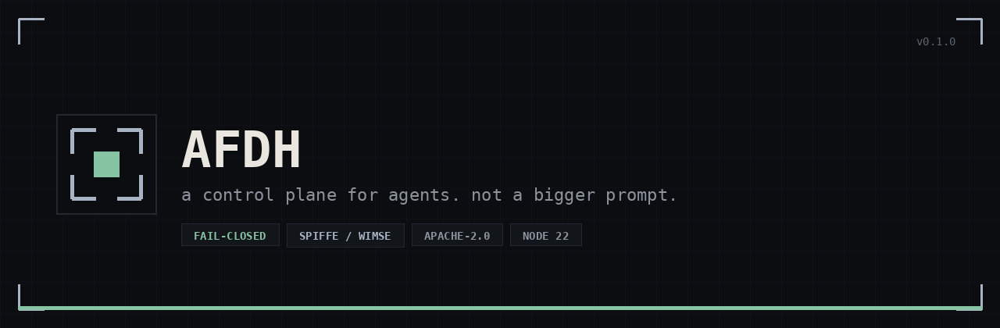
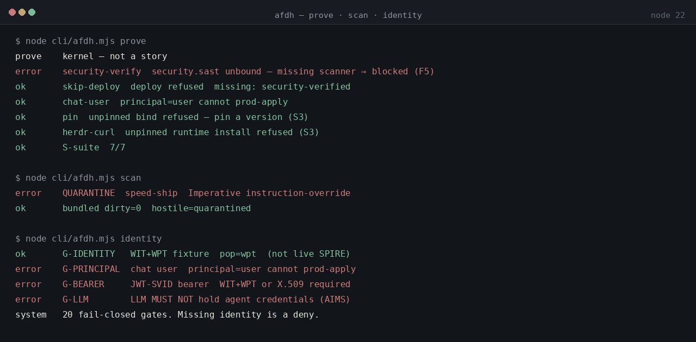

<p align="center">
  
</p>

<h1 align="center">AFDH</h1>

<p align="center">
  <strong>A control plane for agents. Not a bigger prompt.</strong><br>
  Fail-closed policy · portable skills · evidence ladder · SPIFFE/WIMSE identity
</p>

<p align="center">
  <a href="https://github.com/trendy2472024-collab/afdh/actions/workflows/ci.yml"></a>
  <a href="https://github.com/trendy2472024-collab/afdh/releases/tag/v0.1.0"></a>
  <a href="LICENSE"></a>
  <a href=".nvmrc"></a>
  <a href="docs/IDENTITY.md"></a>
  
</p>

<p align="center">
  
</p>

Agents ship on stories: “looks good”, “tests pass”, “YOLO deploy”. That is how you get prompt-injected skills, unbound scanners, and production applies with no human on the loop.

AFDH is a **zero-trust control plane** for agentic SDLC.

| Rule | Meaning |
| --- | --- |
| Intent ≠ grant | Parse the request. Do not treat it as permission. |
| Skills are files | Portable [`SKILL.md`](https://agentskills.io). Extra YAML keys are not required. |
| Bind capabilities | `security.sast`, not a vendor CLI hardcoded in a skill. |
| Evidence is a ladder | Narrative is not a pass. You cannot skip rungs. |
| Missing SAST is a block | Unbound scanner ⇒ deny. Not a warning. |
| Prod-apply is a three-key lock | Evidence + human + workload identity. |

```
intent → orchestrator → specialists
                │
         policy + quarantine
                │
         evidence pack → deploy → observe → factory
```

<p align="center">
  
</p>

<p align="center"><sub>A deny is a pass. Missing SAST, a chat-user principal, and <code>speed-ship</code> are supposed to go red.</sub></p>

---

## Status — 0.1.0 kernel

Honest. CI is the contract. This is not 1.0.

| Enforced in-process, tested in CI | Not yet (typed extension points) |
| --- | --- |
| Catalog scan + quarantine | Live Semgrep / gitleaks / Trivy processes |
| Factory refuse one-off / privilege | Signed catalog + break-glass |
| Bind pin (`latest` and pipe-to-shell denied) | OTel export |
| Evidence ladder + SDLC order (F6) | Multi-agent runtime embedding |
| Secret heuristic (AKIA / `ghp_` / PEM) | Live SPIRE / IRSA / WIF / Entra |
| SPIFFE/WIMSE identity *context* (WIT+WPT, fail-closed) | Crypto verify of a real SVID |
| nvm Node 22 pin + Herdr pane map | Live `nvm use` / Herdr socket |
| 13 portable skills + hostile fixture | npm publish |

This repository is the **headless kernel + CLI**. Scanner adapters implement `ScannerAdapter` in [`src/lib/afdh/adapters.ts`](src/lib/afdh/adapters.ts). A stub ships so the contract is testable today. Real adapters are the highest-leverage PRs — see [good first issues](https://github.com/trendy2472024-collab/afdh/labels/good%20first%20issue).

## 30 seconds

Requires **Node 22+**. Zero runtime dependencies.

```bash
git clone https://github.com/trendy2472024-collab/afdh.git
cd afdh
node cli/afdh.mjs catalog
node cli/afdh.mjs scan      # speed-ship MUST quarantine
node cli/afdh.mjs prove     # fail-closed gates, no agent required
node cli/afdh.mjs eval      # release bar: all S; F1–F3; E2
node cli/afdh.mjs plan "ship the payments webhook"
node cli/afdh.mjs factory once-fix "this repo only"   # must refuse
node cli/afdh.mjs identity  # chat-user MUST deny prod-apply
node cli/afdh.mjs runtime   # nvm 22; herdr pipe-to-shell MUST deny
```

If `scan` does not quarantine `speed-ship`, that is a **release blocker**. Do not ship.

## Why this exists

| Field taught us | AFDH keeps |
| --- | --- |
| Hermes | Scan-time quarantine. `/learn` is a review fork, not a write. |
| Claude Code | Description-as-router. Grants expire. |
| OpenCode | Per-agent allow / deny / ask. |
| DeepSeek | Ranked skill roots, watch / invalidate. |
| Aider | Plan / build split. Reviewer ≠ builder. |

We do **not** copy ungoverned group chat as an SDLC, free skill writes, or README-as-policy.

## Portable skills

One tree, no vendor forks. Core is `SKILL.md`.

```
skills/bundled/<name>/SKILL.md
skills/project/          # default-quarantine
```

| Runtime | Install root |
| --- | --- |
| Claude Code | `.claude/skills` |
| OpenCode | `.opencode/skills` |
| Hermes | `~/.hermes/skills` |
| DeepSeek | `.dsh/skills` |
| [Herdr](https://herdr.dev) | `.herdr/skills` |

Project skills are **untrusted data** until scan + provenance. `speed-ship` is a hostile fixture. It must stay quarantined.

## Policy

- User intent is intent, **not** a permission grant.
- Bind `security.sast`, not `semgrep` hardcoded in a skill.
- Unbound scanner ⇒ blocked. Narrative is not a pass.
- `deploy.prod` and `skills.write` default deny. Human + workload identity.
- Factory refuses one-offs and privilege. No YOLO `/learn`.
- Unpinned binds (`latest`, pipe-to-shell, `herdr.dev/install`, `nvm-sh/nvm`) are refused.

## Evidence ladder

`think → exists → tested → passed → security-verified → deploy-verified → production-ready`

You cannot skip rungs. Deploy cannot run before the evidence gate (F6).

## Identity

Prod-apply is not a boolean. It is a **workload**. The chat user cannot do it. A bearer JWT-SVID cannot do it. An LLM must not hold the credential ([WIMSE AIMS](docs/IDENTITY.md)).

Allowed shapes in 0.1 (structural — not live SPIRE):

- WIT + WPT (proof-of-possession)
- WIT + HTTP Message Signatures
- X.509-SVID

Denied: chat-user, static keys, expired, revoked, shared-node (Spooffe), JWT-SVID bearer, WIT without PoP.

```bash
node cli/afdh.mjs whoami
node cli/afdh.mjs identity
```

## Runtime

Node **22** is pinned in [`.nvmrc`](.nvmrc). [Herdr](https://herdr.dev) is a capability (`runtime.mux`), not an installer. `herdr@0.9.1` is the pin; `latest` and vendor install scripts are denied.

```bash
node cli/afdh.mjs runtime
node cli/afdh.mjs nvm
node cli/afdh.mjs herdr
node cli/afdh.mjs panes
```

The 0.1 CLI maps mission stages onto Herdr pane states (`working` / `blocked` / `idle` / `done`). It does **not** drive a live Herdr socket. That adapter is [issue #7](https://github.com/trendy2472024-collab/afdh/issues/7).

## Repo map

```
cli/afdh.mjs              headless control plane
src/lib/afdh/engine.ts    grant, ladder, evals, prove
src/lib/afdh/identity.ts  SPIFFE/WIMSE identity gate
src/lib/afdh/runtime.ts   nvm Node 22 + Herdr mux
src/lib/afdh/adapters.ts  ScannerAdapter / RuntimeAdapter contract
src/lib/afdh/policy.ts    quarantine + factory + bind pin
skills/                   portable SKILL.md tree
docs/                     architecture, adapters, identity, runtime, roadmap
```

## Documentation

| Doc | For |
| --- | --- |
| [docs/README.md](docs/README.md) | Index |
| [docs/ARCHITECTURE.md](docs/ARCHITECTURE.md) | ADRs, identities, blast radius |
| [docs/ADAPTERS.md](docs/ADAPTERS.md) | Land a pinned scanner |
| [docs/IDENTITY.md](docs/IDENTITY.md) | SPIFFE / WIMSE / Spooffe |
| [docs/RUNTIME.md](docs/RUNTIME.md) | nvm pin + Herdr mux |
| [docs/ROADMAP.md](docs/ROADMAP.md) | 0.2 scanners → 1.0 production bar |

## Contribute

Read [CONTRIBUTING.md](CONTRIBUTING.md). Highest-leverage PRs:

1. A **pinned scanner adapter** behind `security.sast` / `security.secrets` — [#1](https://github.com/trendy2472024-collab/afdh/issues/1), [#2](https://github.com/trendy2472024-collab/afdh/issues/2), [#4](https://github.com/trendy2472024-collab/afdh/issues/4)
2. A **Herdr socket adapter** behind `runtime.mux` that fail-closes when the mux is down — [#7](https://github.com/trendy2472024-collab/afdh/issues/7)
3. A **SPIFFE/SPIRE SVID adapter** — [#5](https://github.com/trendy2472024-collab/afdh/issues/5)
4. A **portable skill** that already exists as a repeated pattern, scan-clean, with an eval
5. A quarantine heuristic that catches a real jailbreak class without false-positiving docs — [#3](https://github.com/trendy2472024-collab/afdh/issues/3)

Do not send: one-off helpers, always-approve-deploy, extra YAML keys, README-as-policy.

Please read the [code of conduct](CODE_OF_CONDUCT.md). Security reports go to [SECURITY.md](SECURITY.md), not a public issue.

## License

Apache-2.0. Copyright 2026 Kingsley Nwaya and AFDH contributors. See [LICENSE](LICENSE) and [NOTICE](NOTICE).
